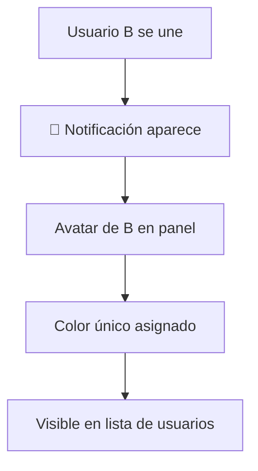
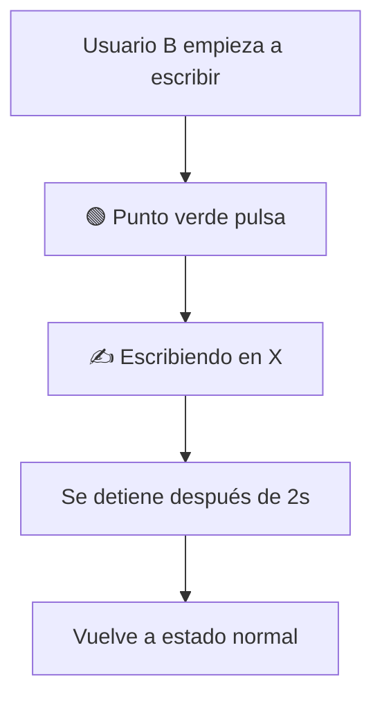
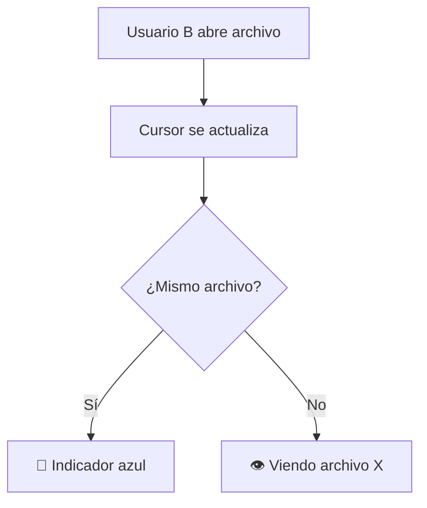

# 🎨 Visualizaciones Interactivas - Colaboración en Tiempo Real

## ✨ Nuevas Funcionalidades Visuales Implementadas

### 1️⃣ **Notificaciones Emergentes** ✅

#### Descripción:
Notificaciones elegantes que aparecen cuando alguien se une o sale de la sesión.

#### Características:
- ✅ **Animaciones suaves** - Entrada desde la derecha con fade-in
- ✅ **Avatar con color** - Muestra el color del usuario y su inicial
- ✅ **Auto-cierre** - Desaparece automáticamente después de 4 segundos
- ✅ **Diferentes tipos:**
  - 🟢 Verde: Usuario se une
  - 🔴 Rojo: Usuario sale
  - 🔵 Azul: Cambio de permisos

#### Cómo se ve:
```
┌────────────────────────────────┐
│  🟢  A  María                  │
│      se ha unido a la sesión   │
└────────────────────────────────┘
```

**Archivos:**
- `src/components/CollaborationNotification.jsx`
- `src/components/CollaborationNotifications.jsx`

---

### 2️⃣ **Indicador "Escribiendo..."** ✅

#### Descripción:
Muestra en tiempo real cuando otro usuario está escribiendo en un archivo.

#### Características:
- ✅ **Detección automática** - Se activa al escribir
- ✅ **Timeout inteligente** - Se oculta 2 segundos después de dejar de escribir
- ✅ **Muestra el archivo** - "✍️ Escribiendo en script.js"
- ✅ **Animación pulsante** - Punto verde que pulsa

#### Ejemplo Visual:

**En el Panel de Colaboración:**
```
┌─────────────────────────────────┐
│ 🟢 M  María                     │
│    📝 Observador                │
│    ✍️ Escribiendo en styles.css│
└─────────────────────────────────┘
```

**Indicador en avatar:**
- 🟢 Punto verde pulsante = Escribiendo
- 🔵 Punto azul fijo = Viendo el mismo archivo que tú
- ⚪ Sin punto = En otro archivo

---

### 3️⃣ **Cursores Remotos** (Preparado) ✅

#### Descripción:
Componente para mostrar los cursores de otros usuarios en el editor.

#### Características:
- ✅ **Cursor con color** - Cada usuario tiene su color único
- ✅ **Etiqueta con nombre** - Aparece por 3 segundos
- ✅ **Animación suave** - Transición fluida al moverse
- ✅ **Indicador de escritura** - Cursor pulsa cuando está escribiendo

#### Cómo funciona:
```javascript
// El cursor se posiciona según línea y columna
<RemoteCursor 
  user={{ name: 'María', color: '#9333ea' }}
  position={{ lineNumber: 10, column: 25 }}
  isTyping={true}
/>
```

**Archivo:**
- `src/components/RemoteCursor.jsx`

---

### 4️⃣ **Indicadores de Usuario Activo en Archivos** ✅

#### Descripción:
Pequeños avatares que muestran qué usuarios están viendo cada archivo.

#### Características:
- ✅ **Stack de avatares** - Hasta 3 usuarios visibles, luego "+N"
- ✅ **Color único** - Cada usuario tiene su color distintivo
- ✅ **Tooltip informativo** - Al pasar el mouse muestra el nombre
- ✅ **Indicador de escritura** - Punto verde si está escribiendo
- ✅ **Animación de pulso** - Efecto visual suave

#### Ejemplo Visual:
```
┌──────────────────────┐
│ index.html  M J +2   │  ← Avatares de usuarios
└──────────────────────┘
```

**Archivo:**
- `src/components/ActiveUserIndicator.jsx`

---

### 5️⃣ **Panel de Colaboración Mejorado** ✅

#### Cambios en el Panel:

**Antes:**
```
└─ María
   └─ Observador
```

**Ahora:**
```
└─ 🟢 María
   └─ 📝 Observador
   └─ ✍️ Escribiendo en styles.css
```

#### Nuevos Estados Visuales:

| Estado | Indicador | Descripción |
|--------|-----------|-------------|
| **Escribiendo** | 🟢 Pulsante + "✍️ Escribiendo en X" | Usuario escribiendo en archivo X |
| **Mismo archivo** | 🔵 Fijo + "• Mismo archivo" | Usuario viendo tu archivo actual |
| **Otro archivo** | ⚪ + "👁️ archivo.js" | Usuario viendo otro archivo |

---

## 🎯 Flujo de Interacción

### Escenario 1: Usuario se une



### Escenario 2: Usuario escribe



### Escenario 3: Cambio de archivo



---

## 📊 Estados Visuales del Panel

### Avatar de Usuario:

```
┌─────────┐
│  🟢 M   │  ← Inicial del usuario
│         │  ← Color de fondo único
└─────────┘
     │
     └─ Indicadores:
        • 🟢 Pulsante = Escribiendo
        • 🔵 Fijo = Mismo archivo
        • ⚪ Sin punto = Otro archivo
```

### Información del Usuario:

```
┌────────────────────────────────┐
│ 🟢 M  María                    │
│       📝 Observador             │
│       ✍️ Escribiendo en X.js   │ ← NUEVO
└────────────────────────────────┘
```

---

## 🔧 Integración Técnica

### Hook useCollaboration - Nuevos Exports:

```javascript
const {
  // ... existentes
  notifications,        // ✨ NUEVO: Lista de notificaciones
  typingUsers,         // ✨ NUEVO: Usuarios escribiendo
  removeNotification,  // ✨ NUEVO: Eliminar notificación
} = useCollaboration(files, setFiles);
```

### Estructura de typingUsers:

```javascript
{
  'userId123': {
    filePath: 'src/index.js',
    timestamp: 1234567890
  }
}
```

### Estructura de notifications:

```javascript
{
  id: 'unique-id',
  type: 'user-joined' | 'user-left' | 'permission-changed',
  userName: 'María',
  userColor: '#9333ea',
  message: 'se ha unido a la sesión'
}
```

---

## 🎨 Animaciones CSS

### 1. Pulse (Escribiendo)
```css
@keyframes pulse {
  0%, 100% { opacity: 1; }
  50% { opacity: 0.5; }
}
```

### 2. Fade In (Notificaciones)
```css
@keyframes fadeIn {
  from { 
    opacity: 0; 
    transform: translateY(-5px); 
  }
  to { 
    opacity: 1; 
    transform: translateY(0); 
  }
}
```

### 3. Blink (Indicadores)
```css
@keyframes blink {
  0%, 100% { opacity: 1; }
  50% { opacity: 0.3; }
}
```

---

## 🚀 Cómo Probarlo

### Test 1: Notificaciones

1. **Usuario A**: Crea sesión
2. **Usuario B**: Se une usando el enlace
3. **Resultado**: 
   - ✅ Usuario A ve notificación: "María se ha unido"
   - ✅ Notificación desaparece en 4 segundos

### Test 2: Indicador Escribiendo

1. **Ambos usuarios**: Abren el panel de colaboración
2. **Usuario B**: Empieza a escribir en `styles.css`
3. **Usuario A ve**:
   - ✅ Punto verde pulsante en avatar de B
   - ✅ Texto: "✍️ Escribiendo en styles.css"
4. **Usuario B para de escribir**
5. **Usuario A ve**:
   - ✅ Indicador desaparece después de 2 segundos

### Test 3: Mismo Archivo

1. **Usuario A**: Abre `index.html`
2. **Usuario B**: Abre `index.html`
3. **Usuario A ve**:
   - ✅ Punto azul en avatar de B
   - ✅ Texto: "• Mismo archivo"

### Test 4: Archivo Diferente

1. **Usuario A**: Está en `index.html`
2. **Usuario B**: Abre `script.js`
3. **Usuario A ve**:
   - ✅ Sin punto de color
   - ✅ Texto: "👁️ script.js"

---

## 📦 Archivos Nuevos Creados

```
src/components/
├── RemoteCursor.jsx                    ✨ NUEVO
├── CollaborationNotification.jsx       ✨ NUEVO
├── CollaborationNotifications.jsx      ✨ NUEVO
└── ActiveUserIndicator.jsx            ✨ NUEVO
```

## 📝 Archivos Modificados

```
src/
├── hooks/
│   └── useCollaboration.js            🔧 Modificado
├── components/
│   ├── CollaborationPanel.jsx         🔧 Modificado
│   └── App.jsx                        🔧 Modificado
```

---

## 🎉 Resultado Final

### Antes:
- ❌ Sin notificaciones de eventos
- ❌ No sabes si otros están escribiendo
- ❌ No sabes qué archivo están viendo
- ❌ Interacción limitada

### Ahora:
- ✅ **Notificaciones elegantes** cuando alguien se une/sale
- ✅ **Indicador "Escribiendo..."** en tiempo real
- ✅ **Ver qué archivo** está viendo cada usuario
- ✅ **Animaciones suaves** y profesionales
- ✅ **Feedback visual inmediato** de todas las acciones
- ✅ **Colores únicos** para cada usuario
- ✅ **Experiencia interactiva completa**

---

## 🔮 Próximas Mejoras Posibles

1. **Cursores en Monaco Editor** - Mostrar cursores de otros usuarios directamente en el código
2. **Selección compartida** - Ver qué texto tienen seleccionado otros usuarios
3. **Mensajes en chat** - Sistema de chat integrado
4. **Historial de cambios** - Ver quién hizo qué cambio y cuándo
5. **Modo seguir** - Seguir el cursor de otro usuario
6. **Video/Audio** - Llamada integrada mientras colaboran

---

**¡La colaboración ahora es completamente visual e interactiva!** 🎨✨

Cada acción de los usuarios se refleja instantáneamente con feedback visual claro y elegante.
